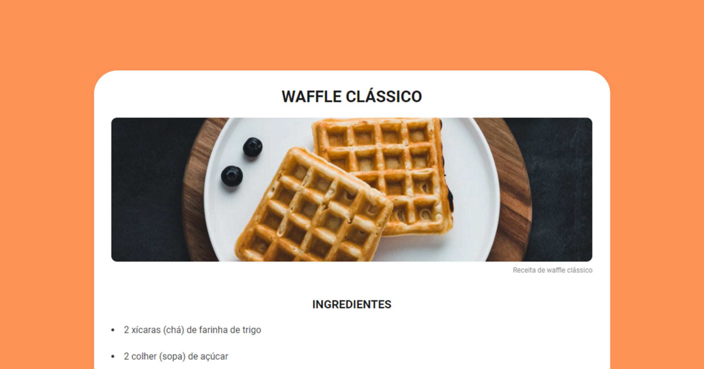

<h1 align="center"> Página de receita </h1>

  <a href="#-tecnologias">Tecnologias</a>&nbsp;&nbsp;&nbsp;|&nbsp;&nbsp;&nbsp;
  <a href="#-projeto">Projeto</a>&nbsp;&nbsp;&nbsp;|&nbsp;&nbsp;&nbsp;
  <a href="#memo-licença">Licença</a>

  

 

## 🚀 Tecnologias

Esse projeto foi desenvolvido com as seguintes tecnologias:

- HTML e CSS
- Git e Github

## Projeto

O desafio proposto foi de criar uma página web de uma receita com título, imagem, lista de ingredientes e modo de preparo.

## :memo: Licença

Esse projeto está sob a licença MIT.

---

Feito por Gabriel Augusto
